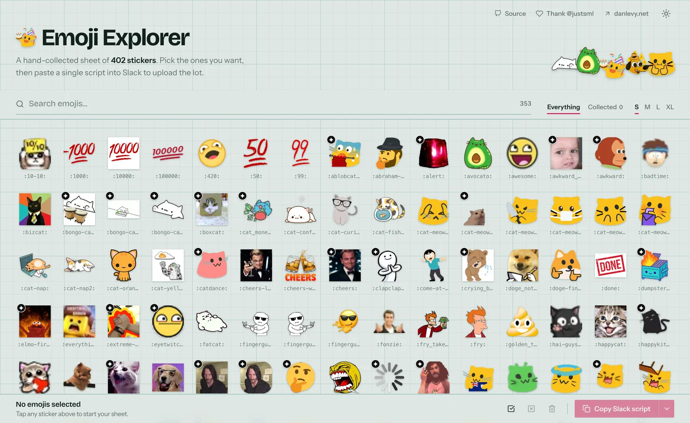

<div align="center">


# Emoji Explorer

**Browse a hand-collected sheet of 350+ custom emoji and stickers, pick your favorites, and paste one script into Slack to upload the lot.**

[](https://github.com/justsml/emoji-brain/actions/workflows/emojis.yml)
[](https://github.com/justsml/emoji-brain/commits/main)
[](https://github.com/justsml/emoji-brain/issues)
[](https://github.com/justsml/emoji-brain/stargazers)
[](public/emojis/)
[](https://github.com/justsml/emoji-brain/pulls)

[](https://emoji-brain.vercel.app/)
[](https://emoji-brain.netlify.app/)

[](https://astro.build/)
[](https://react.dev/)
[](https://www.typescriptlang.org/)
[](https://tailwindcss.com/)
[](https://pagefind.app/)
[](https://nodejs.org/)
[](https://pnpm.io/)
[](https://playwright.dev/)
[](https://vitest.dev/)

<a href="https://emoji-brain.vercel.app/">
  <picture>
    <source media="(prefers-color-scheme: dark)" srcset="docs/screenshot-dark.webp">
    
  </picture>
</a>

<sub>Click the preview to open the live app. Screenshot follows your GitHub color scheme.</sub>

</div>

Emoji Explorer (`emoji-brain`) is a self-hostable, static [Astro](https://astro.build/) app with a React interface and no backend. Search, select, then export to Slack, ZIP, HTML, CSS, or Markdown.

## What you can do

- Search emoji metadata with Pagefind, with a local text-search fallback when Pagefind is unavailable.
- Adjust the grid size and filter the view to your selected emojis.
- Keep your selection between visits using localStorage.
- Copy a Slack browser upload script with the selected images embedded.
- Export filenames, HTML, CSS, or a Markdown table to the clipboard, or download the images as a ZIP.
- Switch between light and dark themes, with the initial theme following your system preference.

## Use the collection

1. Open the [Vercel demo](https://emoji-brain.vercel.app/) or [Netlify demo](https://emoji-brain.netlify.app/).
2. Search for emojis and click the ones you want to add to your sheet. Click again to remove one.
3. Choose **Copy Slack script**, or open **Other export options** beside it for the other formats.

For Slack, sign in to your workspace and open `https://YOUR-WORKSPACE.slack.com/customize/emoji`. Open your browser's developer tools, select **Console**, paste the generated script, and press **Enter**. Leave the page open to see progress and the final counts. Your workspace must allow you to add custom emoji.

Plain-text export copies filenames. HTML, CSS, and Markdown exports reference images on the site you exported from; ZIP includes the image files themselves.

## Run locally

Have Node.js 24 and pnpm 11 installed. Bun is also needed for the repository's TypeScript maintenance scripts and builds.

```bash
git clone https://github.com/justsml/emoji-brain.git
cd emoji-brain
pnpm install
pnpm dev
```

Open `http://localhost:3000`. Set `PORT` to use another development port, for example `PORT=3001 pnpm dev`.

`pnpm preview` also honors `PORT`, defaulting to `4321`. For example, `PORT=3001 pnpm preview` serves the production build on port `3001`.

```bash
# Build the static site into dist/
pnpm build

# Preview the production build
pnpm preview
```

Deploy `dist/` to a static host such as Vercel or Netlify, using `pnpm build` as the build command.

## Collection and search data

Images live in [`public/emojis/`](public/emojis/), and the app reads [`src/data/emoji-metadata.json`](src/data/emoji-metadata.json). Each metadata entry includes an ID, filename, public path, tags, categories, creation date, and size in bytes.

Use the two collection commands:

```bash
pnpm check-emojis                         # read-only Markdown report
pnpm check-emojis --json --report=report.json
pnpm update-emojis --update=none          # offline maintenance
pnpm update-emojis                        # label new/changed/unlabelled images
pnpm update-emojis --update               # same as --update=changes
pnpm update-emojis --update=all           # relabel every image
```

Put new images in `public/emojis/ingest/` or directly in `public/emojis/`. Updates count new, changed, newly tracked, removed, converted, ingested, labelled, and animated files; validate images; convert PNG, JPEG, GIF, TIFF, and AVIF to WebP; preserve animation; refresh metadata and first-frame stills; validate the result; and rebuild Pagefind. Filename collisions stop the update before conversion. Originals are removed only after their converted output decodes successfully. Metadata for deleted images and orphaned stills is removed.

Live modes are maintainer-only local operations and are disabled in CI. Set `OPENROUTER_API_KEY` to use Gemini through `@openrouter/ai-sdk-provider` with model `google/gemini-3.8-flash`; OpenRouter takes precedence when both providers have keys. For direct Google access, they accept `GOOGLE_API_KEY`, `GEMINI_API_KEY`, or `GOOGLE_GENERATIVE_AI_API_KEY` in that precedence order (Bun loads `.env`) and send selected images to Google Gemini for labelling, directly or through OpenRouter. Missing or whitespace-only keys fail before ingest; configured keys are validated by the provider when labelling runs. `changes` is the default with no arguments or a bare `--update`. It selects new images, changed hashes, missing tags/categories, and stale explicit `labelHash` values. Legacy entries without `labelHash` retain their existing labels when the recorded image hash matches. Offline updates preserve the old label hash so changed content still needs labelling. Existing IDs, creation dates, aliases, and custom fields are preserved. Labelling errors fail the command and leave the previous metadata file intact; completed conversions may remain and can be safely retried.

Checks print a compact terminal table and report prior metadata existence, missing files, SHA-256 changes, filesystem modification-date changes, actual image type, required fields, duplicate IDs/filenames, duplicate content, dimensions, and animated still availability. `--json` remains available for machine-readable output, while GitHub step summaries use Markdown. Invalid, stale, hash-changed, or unlabelled records and pending ingests exit with status 1. Labels must include nonempty tags and categories, and an explicit `labelHash` must match the current image hash. Legacy entries without it are accepted when their recorded image hash matches. Filesystem modification-date changes are informational because timestamps change on checkout. Run `pnpm update-emojis --update=changes` to import images, refresh metadata, and label pending images. Missing credentials fail before any image changes and print setup instructions and the pending image list.

Completeness is informational: 25% for populated fields out of 12 (`id`, `filename`, `path`, `created`, `modified`, `hash`, `size`, `width`, `height`, `tags`, `aliases`, `categories`), 25% for at least three unique tags, 25% for at least one alias, and 25% for at least two unique categories. Empty label arrays and stale explicit `labelHash` fail validation; empty aliases and the completeness percentage alone do not. Offline maintenance can save pending state, but its final validation fails until labelling is complete. Aliases are curated rather than invented by the labeller.

Labelling requests use a fixed seed (`42`) and minimal thinking through both providers: Google's `thinkingConfig.thinkingLevel` and OpenRouter's `reasoning.effort`. This provides best-effort repeatability, not guaranteed identical labels; minimal thinking controls reasoning effort, not determinism. Temperature, top-p, and top-k retain the provider defaults, following [Google's Gemini 3 sampling guidance](https://ai.google.dev/gemini-api/docs/generate-content/whats-new-gemini-3.5).

`pnpm build` always regenerates the Pagefind index. The old conversion, ingest, metadata, and still-generation package commands are replaced by `update-emojis`.

The [GitHub workflow](.github/workflows/emojis.yml) runs `pnpm check-emojis` on pull requests, failing for pending ingests, pending labelling, changed image content, stale metadata, or other validation errors. Failures list images pending labelling and tell contributors to run `pnpm update-emojis --update=changes` locally, rerun the check, and commit the resulting changes. Local failures detect whether a supported API key is configured and provide setup instructions when missing. CI never requires a key for validation. Filesystem timestamp differences alone do not fail the check. Unit tests run on PRs, pushes to `main`, and manual dispatches, even when emoji validation fails. Builds run on `main` only after checks pass. Superseded PR runs are cancelled. Successful pushes publish a prerelease named `main-<commit>` containing the static site archive. CI has no AI credentials, and both the update command and labeller reject live calls in CI. Reports include recovery instructions and pending image lists. Reports and site archives are retained as workflow artifacts for 14 days; release archives remain attached to the prerelease. Re-running a release replaces its existing archive.

Repository settings require approval for **all external contributors'** GitHub Actions runs, including returning contributors. Protected `main` requires the GitHub Actions `check-emojis` status check and an up-to-date branch before ordinary PR merges. Code-owner review and stale-review dismissal are enabled. Administrators can bypass protection. These settings were verified on 2026-09-09. [CODEOWNERS](.github/CODEOWNERS) assigns review to the current maintainers. Approval to run a workflow is separate from approval to merge a PR. These GitHub settings must also be configured when forking the repository; files alone cannot enforce them.

## Tests

```bash
# Unit and component tests (Vitest)
pnpm test

# Watch unit tests
pnpm test:watch

# Install the browser used by the E2E suite (first run)
pnpm exec playwright install chromium

# E2E tests run against the production preview, so build first
pnpm build
pnpm test:e2e
```

Playwright starts the preview server at `http://localhost:4321`. See [`TESTING.md`](TESTING.md) for test locations and configuration.

## Project structure

| Path | Purpose |
| --- | --- |
| `src/pages/`, `src/layouts/` | Astro page and site shell |
| `src/components/` | React interface and component tests |
| `src/context/`, `src/hooks/` | Selection state and localStorage persistence |
| `src/lib/` | Export helpers and Slack script generation |
| `src/data/`, `src/types/` | Emoji metadata and TypeScript definitions |
| `src/styles/` | Global and component styles |
| `public/emojis/` | Emoji image files |
| `public/pagefind/` | Generated client-side search index |
| `scripts/` | Image conversion, metadata, indexing, and import utilities |
| `tests/` | Playwright scenarios and shared test setup |

Built with Astro, React, TypeScript, Tailwind CSS, shadcn/ui components, Pagefind, and JSZip. UI state uses React Context and a reducer.

## Ideas for later

- [ ] Discord import/export script generator
- [ ] Upload custom emojis through the app
- [ ] AI emoji remixer, possibly local
- [ ] Share selections through URL state
- [ ] Authentication and access controls

[Suggest an emoji or report an issue](https://github.com/justsml/emoji-brain/issues/new).
